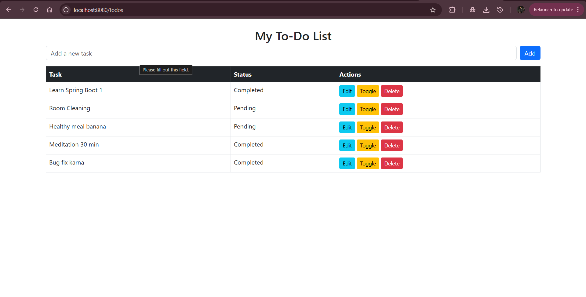
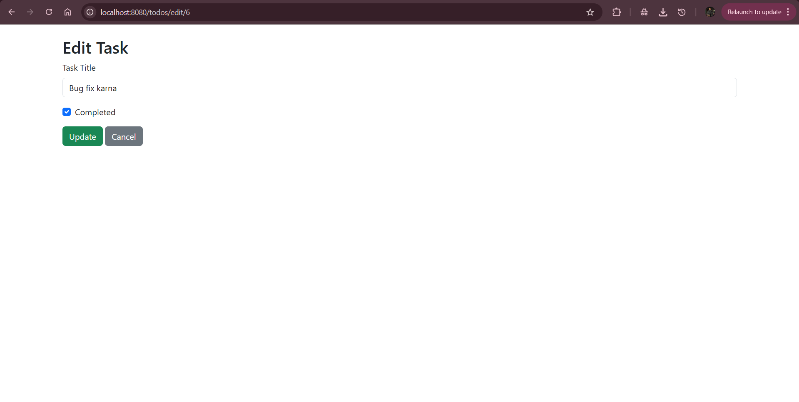
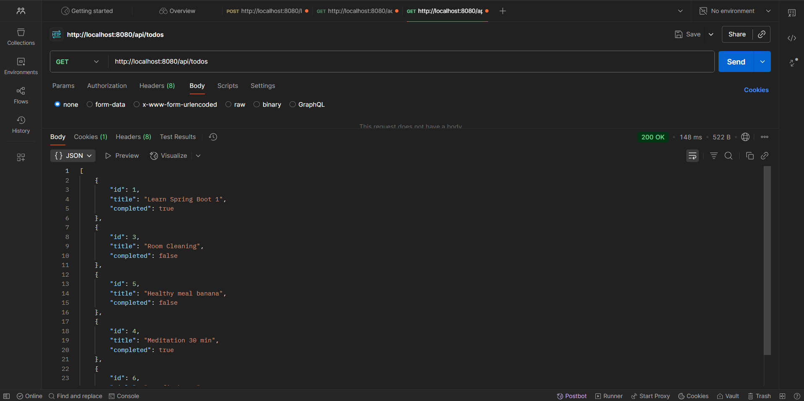

# To-Do App (Spring Boot + PostgreSQL + Thymeleaf)

A simple and efficient **To-Do List application** built using **Spring Boot**, **PostgreSQL**, **Thymeleaf**, and tested via **Postman**.  
This app allows users to **add, update, delete, toggle, and view tasks** seamlessly via both **web interface** and **REST API**.

---

## Features
- Add new tasks  
- Edit existing tasks  
- Mark tasks as Completed/Pending (Toggle)  
- Delete tasks  
- View tasks in **browser (Thymeleaf UI)**  
- Test all APIs in **Postman**  
- Data stored in **PostgreSQL database**

---

## Tech Stack
- **Backend:** Spring Boot, Spring Data JPA  
- **Frontend:** Thymeleaf + Bootstrap  
- **Database:** PostgreSQL  
- **Tools:** Postman, Maven, GitHub  

---

## Project Structure
```
todo_app/
│── src/
│ ├── main/
│ │ ├── java/com/todo/todo_app/
│ │ │ ├── controller/
│ │ │ │ └── TodoWebController.java
│ │ │ ├── entity/
│ │ │ │ └── Todo.java
│ │ │ ├── repository/
│ │ │ │ └── TodoRepository.java
│ │ │ ├── service/
│ │ │ │ └── TodoService.java
│ │ │ └── TodoAppApplication.java
│ │ ├── resources/
│ │ │ ├── templates/
│ │ │ │ ├── todos.html
│ │ │ │ └── edit.html
│ │ │ └── application.properties
│── pom.xml
│── README.md
```
---

## REST API Endpoints

### 1. Get all tasks
GET /todos

**Response (JSON in Postman / HTML in browser):**
```json
[
  {
    "id": 1,
    "title": "Learn Spring Boot",
    "completed": false
  }
]

2. Add a new task
POST /todos
Request Body (JSON for Postman):
{
  "title": "Complete Project",
  "completed": false
}

3. Get a task by ID
GET /todos/{id}
Response:
{
  "id": 1,
  "title": "Learn Spring Boot",
  "completed": false
}

4. Update a task
POST /todos/update/{id}
Request Body (JSON):
{
  "title": "Learn Spring Boot Advanced",
  "completed": true
}

5. Toggle a task’s status
GET /todos/toggle/{id}

6. Delete a task
GET /todos/delete/{id}
```
---

## 📸 Screenshots

### 🖥 Home Page


### 🖥 Edit Page


### 🖥 Postman CRUD Operation


---

## How to Run

## Clone the repository:
```
git clone https://github.com/yourusername/todo_app.git
```

## Setup PostgreSQL and update application.properties:
```
spring.datasource.url=jdbc:postgresql://localhost:5432/todo_db
spring.datasource.username=yourusername
spring.datasource.password=yourpassword
spring.jpa.hibernate.ddl-auto=update
```

## Run the application:
```
mvn spring-boot:run
```

## Open in browser:
```
http://localhost:8080/todos
```

## Test APIs in Postman.
---

<h2 align="center">🤝 Contributing</h2>
<p align="center">
Contributions are welcome!<br>
If you’d like to improve this project, feel free to fork the repo and submit a pull request.<br>
Please make sure to follow proper commit messages and coding guidelines.
</p>


<h2 align="center">👨‍💻 Author</h2>
<p align="center">
<strong>Pratyush Gupta</strong><br>
GitHub: <a href="https://github.com/pratyushgupta2396">Pratyush Gupta</a><br>
LinkedIn: <a href="https://www.linkedin.com/in/pratyushgupta2396/">Pratyush Gupta</a>
</p>

<h2 align="center">💬 Support & Feedback</h2>
<p align="center">
For any issues, bugs, or feature requests, please open an <a href="../../issues">issue here</a>.
</p>

<h2 align="center">🙌 Acknowledgements</h2>
<p align="center">Thanks for checking out this project! Give it a ⭐ if you found it helpful.</p>
